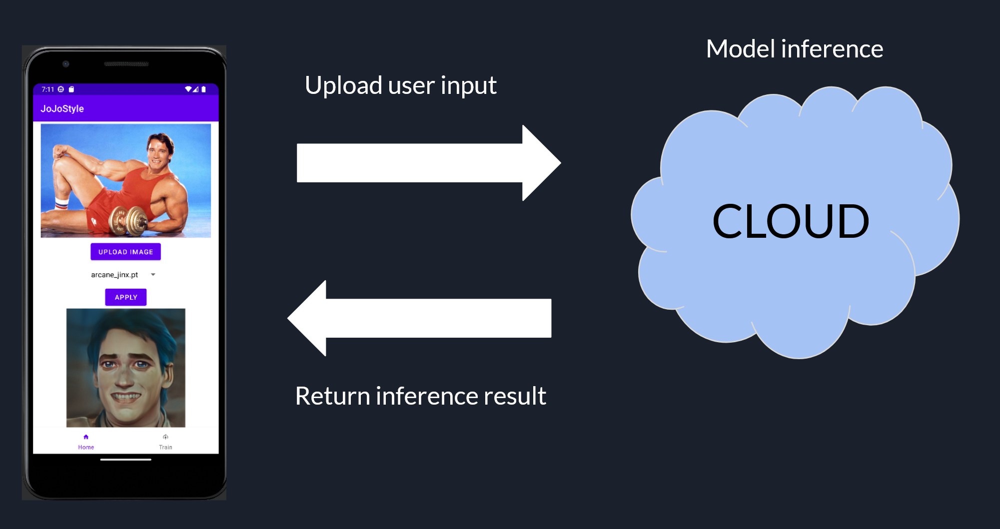

# CE4171: Internet of Things: Communication & Networking

## JoJoStyle Mobile Application

For this project, I have created a mobile application that is able to perform one shot image stylisation and training using the user's smartphone. The user can either take an image of the bank note using their smartphone's camera or select a bank note image that downloaded from the internet. The user is able to send the image over to the model that is hosted on remote server and conduct the inference on the selected image, using a avalible model. The resulting stylised image will be sent back to the app which will be displayed to the user.

# Part 1: JoJoGan

This version of JoJoGan in windows is obtained from 
https://github.com/bycloudai/JoJoGAN-Training-Windows

Instructions for installing enviroment can be found above

the original files are as follows:
IoT-Project\JoJoGAN-Training-Windows\inference.py (inference class)
IoT-Project\JoJoGAN-Training-Windows\train_model.py (model training class)

# Part 2: Inference Dameon
IoT-Project\JoJoGAN-Training-Windows\inference_generator.py (server dameon class)

This class acted as the background/housekeeping task that performed the inference and training as required

# Part 3: Webserver
IoT-Project/web_server/main.py (webserver)

Flask server implementation. Provided the endpoints for the android application.

# Part 4: IoT Application
\iot_app\

The IoT application coded in android studios

# Tasks Checklist

- Local Inference:
  - Collect User Input (15)
    - Collected real-time input using touch:white_check_mark:
  - Infer remotely and display result (20)
    - Inference is offload to Remote server :white_check_mark:
    - Result is displayed to user via dialog box :white_check_mark:
  - Run on Emulated/physical IoT device (15)
    - Ran on Emulated Android Device :white_check_mark:
- Cloud Inference:
  - Run inference in cloud virtual machine (10)
    - Model is hosted remote server:white_check_mark:
  - Communicatation between IoT device & cloud (20)
    - App sends image data to remote server end point for inference :white_check_mark:
    - Results from the model's inference sent back from the cloud to the app :white_check_mark:
- Advanced Tasks:
  - Train your own model (10)
    - Trained my own model using own data :white_check_mark:
  - Run time model updating(10)
    - Allowed users to dynamically train a new model at run time :white_check_mark:
  - Support multiple concurrent users (10)
    - Azure Machine Learning is able to support multiple concurrent users hitting it's service's end point :white_check_mark:

# Video Demo on Actual Android Device

<a href="https://youtu.be/trkiVvVaZhU" target="_blank">Youtube Link</a>